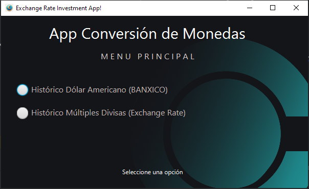
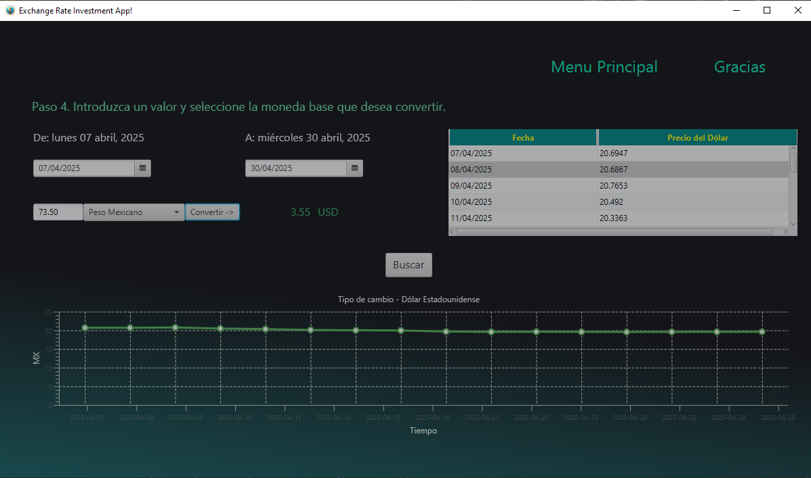
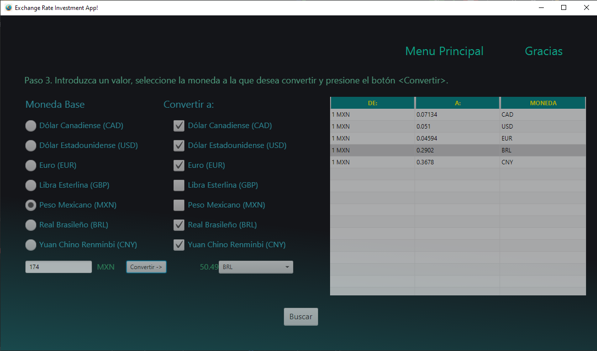

# Proyecto: Conversor de Monedas  

## Objetivo

Este proyecto tiene como objetivo aplicar los conocimientos adquiridos en la Beca Oracle One.  
Para este proyecto se tuvo la oportunidad de emplear los conceptos adquiridos en la Programación Java.

## Descripción

El proyecto está conformado por un escenario principal (stage) llamado main-menu-view.fxml, el cual está asociado a su correspondiente aplicación MainMenuApplication y su controlador MainMenuController. A partir de este escenario, se llamarán otros dos escenarios, dependiendo de la selección del usuario. A continuación se detallan los siguientes dos escenarios:

### historicdolarmenu-view.fxml
**Archivos asociados:** HistoricDolarMenuApplication (sólo para pruebas) e HistoricDolarMenuController.

Se utiliza una API al Banco de México. Se introduce un intervalo de fechas y se obtendrá información del tipo de cambio del Dólar con la Moneda Mexicana. La información se mostrará en una tabla. Al seleccionar un renglón de la tabla se procederá a realizar una conversión entre las dos divisas.

### standardendpointmenu-view.fxml
**Archivos asociados:** StandardEndpointMenuApplication (sólo para pruebas) y StandardEndpointMenuController.

Se utiliza una API del portal Exchange Rate. Es necesario selecionar una moneda base y posteriormente se seleccionara al menos una divisa o varias a las que se desea saber el tipo de cambio, la información se mostrará en una tabla. Al seleccionar un renglón de la moneda a la que se desea convertir se procederá a realizar una conversión entre las dos divisas.

A lo largo de todo el código del proyecto, se abarcaron los siguientes conceptos de Java:

1. Casting entre diferentes objetos y primitivas en Java
2. Ciclo for
3. Arrays y ArrayLists
4. Trabajando y convirtiendo entre fechas
5. Formateo de texto
6. Solicitudes HTTP usando APIs
7. Empleo de Jackson para la deserialización/parsing de un objeto Json
8. Regular Expressions en Java
9. Programación Orientada a Objetos
- Getters y Setters
- Sobrecarga de constructores
- Encapsulamiento
10. Manejo de Excepciones
11. Interfaz gráfica con JavaFX
- Controles: ChoiceBox, DatePicker, Button, TextField, Label, Image
- LineChart (Gráficas de Línea)
- TableView (Tablas)
12. CSS (Hojas de Estilo en Cascada)
13. JavaDocs

## Capturas de Pantalla

## Referencias

### Videos de Youtube
[Curso JavaFx - Bro Code - 30 videos](https://www.youtube.com/watch?v=_7OM-cMYWbQ&list=PLZPZq0r_RZOM-8vJA3NQFZB7JroDcMwev)  

[Parsing Json con Jackson - CoderFromScratch - 3 videos](https://www.youtube.com/watch?v=Hv_a3ZBSO_g&list=PLAuGQNR28pW4dOc5uytMdzcQ4-TCJFUN4)  

[Jackson Serialization and Deserialization - Baeldung - Java and Spring - 12 videos](https://www.youtube.com/watch?v=Hv_a3ZBSO_g&list=PLAuGQNR28pW4dOc5uytMdzcQ4-TCJFUN4)  

[JavaFX and Scene Builder Course - Random code - 126 videos](https://www.youtube.com/watch?v=WDaXpDtYk3E&list=PLrzWQu7Ajpi26jZvP8JhEJgFPFEj_fojO&index=1)  

### Foros
[stack overflow](https://stackoverflow.com/questions)  

### Documentación
[JavaFX CSS Reference Guide](https://docs.oracle.com/javafx/2/api/javafx/scene/doc-files/cssref.html)  

[Class Formatter](https://docs.oracle.com/javase/7/docs/api/java/util/Formatter.html#syntax)  

[Exchange Rate](https://www.exchangerate-api.com/docs/standard-requests)  

[SIE API - Banco de México](https://www.banxico.org.mx/SieAPIRest/service/v1/)  

[Teclas de Atajo de IntelliJ](https://www.jetbrains.com/help/idea/reference-keymap-win-default.html#code_folding)  

### Otros
[REQBIN - Prueba de Solicitudes HTTP](https://reqbin.com/mvzj7dss)  

## Agradecimiento

Muchas gracias a las siguientes personas:  
- A todo el equipo Alura Latam. Por compartir sus conocimientos y experiencia.
- Google Gemini por haber tenido tanta paciencia en haberme explicado por las piedritas (paso a paso), cada una de las líneas de código recomendadas.
- Bro Code y sus videos en Youtube por haberme abierto los ojos a la mejor opción de interfaz gráfica en el mundo Java. Thanks so much, brother.

Miguel Ángel Molinero  
CDMX  
<mmolinero12@gmail.com>

